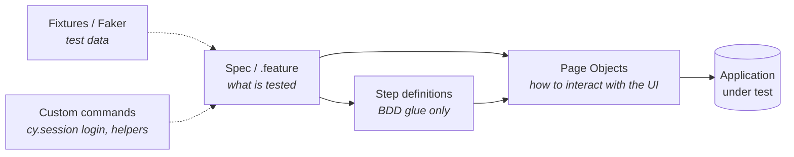

<div align="center">

# 🧪 QA Automation Portfolio

**End-to-end & API test automation by [Ivan Armadi](https://github.com/HivanA98)**


_13 projects · 180+ automated tests · 12 real-world applications · every project runs in CI_

</div>

---

## ✨ What this repository shows

|     | Skill                                                                                     | Where to look                                                                            |
| :-: | ----------------------------------------------------------------------------------------- | ---------------------------------------------------------------------------------------- |
| 🧱  | **Page Object Model** with chainable actions and reusable components                      | every Cypress project – `cypress/pages`                                                  |
| 🥒  | **BDD with Gherkin** – Scenario Outlines, Data Tables, tag strategy                       | [Saucedemo-BDD](Saucedemo-BDD), [BeautyHaul-BDD](BeautyHaul-BDD), [Voila-BDD](Voila-BDD) |
| 🌐  | **Network stubbing** with `cy.intercept` to test UI without hitting a protected backend   | [BeautyHaul](BeautyHaul)                                                                 |
| ⚡  | **Fast, stable logins** with `cy.session()` and API login via `cy.request`                | [Websecurity](Websecurity), [Saucedemo](Saucedemo)                                       |
| 🎲  | **Data-driven & generated test data** – fixtures and Faker                                | [DemoQA](DemoQA), [HeroKuApp](HeroKuApp)                                                 |
| 🔐  | **Secrets management** – credentials in git-ignored env files / CI secrets, never in code | [Voila-BDD](Voila-BDD), [PayEver](PayEver), [GreenHoop](GreenHoop)                       |
| 🔌  | **API testing** – CRUD, JSON schemas, chained requests, parallel execution                | [API_Karate_Framework](API_Karate_Framework)                                             |
| 🤖  | **CI/CD** – one reusable GitHub Actions workflow, one status badge per project            | [`.github/workflows`](.github/workflows)                                                 |

## 📦 Projects

| Project                                          | Status                                                                                                                                                                                            | Stack              | Application            |  Tests   |
| ------------------------------------------------ | ------------------------------------------------------------------------------------------------------------------------------------------------------------------------------------------------- | ------------------ | ---------------------- | :------: |
| [**Saucedemo**](Saucedemo)                       | [](https://github.com/HivanA98/Cypress-CodeJS/actions/workflows/saucedemo.yml)                  | Cypress            | saucedemo.com          |    27    |
| [**Saucedemo-BDD**](Saucedemo-BDD)               | [](https://github.com/HivanA98/Cypress-CodeJS/actions/workflows/saucedemo-bdd.yml)      | Cypress · Cucumber | saucedemo.com          |    17    |
| [**BeautyHaul**](BeautyHaul)                     | [](https://github.com/HivanA98/Cypress-CodeJS/actions/workflows/beautyhaul.yml)               | Cypress            | beautyhaul.com         |    16    |
| [**BeautyHaul-BDD**](BeautyHaul-BDD)             | [](https://github.com/HivanA98/Cypress-CodeJS/actions/workflows/beautyhaul-bdd.yml)   | Cypress · Cucumber | beautyhaul.com         |    13    |
| [**DemoQA**](DemoQA)                             | [](https://github.com/HivanA98/Cypress-CodeJS/actions/workflows/demoqa.yml)                           | Cypress · Faker    | demoqa.com             |    28    |
| [**HeroKuApp**](HeroKuApp)                       | [](https://github.com/HivanA98/Cypress-CodeJS/actions/workflows/herokuapp.yml)            | Cypress            | CURA Healthcare        |    15    |
| [**RahulAcademy**](RahulAcademy)                 | [](https://github.com/HivanA98/Cypress-CodeJS/actions/workflows/rahulacademy.yml) | Cypress            | rahulshettyacademy.com |    20    |
| [**Websecurity**](Websecurity)                   | [](https://github.com/HivanA98/Cypress-CodeJS/actions/workflows/websecurity.yml)              | Cypress            | Zero Bank              |    11    |
| [**Voila-BDD**](Voila-BDD)                       | [](https://github.com/HivanA98/Cypress-CodeJS/actions/workflows/voila-bdd.yml)               | Cypress · Cucumber | voila.id               | 6 + auth |
| [**PayEver**](PayEver)                           | [](https://github.com/HivanA98/Cypress-CodeJS/actions/workflows/payever.yml)                        | Cypress            | PayEver commerceOS     | 5 + auth |
| [**GreenHoop**](GreenHoop)                       | [](https://github.com/HivanA98/Cypress-CodeJS/actions/workflows/greenhoop.yml)                  | Cypress            | GreenHoop UAT          | 3 + auth |
| [**DraftCypressFile**](DraftCypressFile)         | [](https://github.com/HivanA98/Cypress-CodeJS/actions/workflows/template.yml)             | Cypress template   | example.cypress.io     |    5     |
| [**API_Karate_Framework**](API_Karate_Framework) | [](https://github.com/HivanA98/Cypress-CodeJS/actions/workflows/karate.yml)                       | Karate · JUnit 5   | JSONPlaceholder        |    16    |

> **+ auth** – extra scenarios that run only when a test account is provided (see [Secrets](#-secrets)).

## 🏗️ Architecture

Every Cypress project shares the same layered structure, so a reviewer can open any folder and feel at home.



```
<Project>/
├── cypress/
│   ├── e2e/          # specs (*.cy.js) or Gherkin (*.feature)
│   ├── pages/        # Page Objects + shared components
│   ├── fixtures/     # test data
│   └── support/      # custom commands, step definitions, global setup
├── cypress.config.js
└── package.json
```

A spec reads like a test case, with no raw selectors:

```js
it('E2E: completes checkout with multiple products', () => {
  checkoutPage.fillInformation(customer).continue()
  checkoutPage.shouldHaveCorrectTotals().finish()
  checkoutPage.shouldBeComplete()
  header.shouldHaveCartCount(0)
})
```

## 🚀 Getting started

**Requirements:** Node.js 22+ for Cypress projects, Java 17 + Maven for Karate.

```bash
git clone https://github.com/HivanA98/Cypress-CodeJS.git
cd Cypress-CodeJS/Saucedemo     # pick any project
npm install
npm run cy:open                 # interactive runner
npm test                        # headless run + HTML report in cypress/reports
```

## 🔐 Secrets

Projects that need a real account read credentials from a git-ignored `cypress.env.json`
(copy `cypress.env.example.json`). In CI the same JSON is provided as a repository secret:

| Project   | Repository secret       |
| --------- | ----------------------- |
| Voila-BDD | `VOILA_CYPRESS_ENV`     |
| PayEver   | `PAYEVER_CYPRESS_ENV`   |
| GreenHoop | `GREENHOOP_CYPRESS_ENV` |

Without the secret the workflow still runs and simply skips the account-only scenarios.

## 🤖 Continuous Integration

- [`cypress-reusable.yml`](.github/workflows/cypress-reusable.yml) – install, verify Cypress, run, upload the report
- One small workflow per project calls it, so every project gets **its own badge** and only runs when its folder changes
- A weekly scheduled run detects changes on the live websites
- HTML reports and failure screenshots are uploaded as build artifacts

## 🏷️ Versioning

`vMAJOR.MINOR.PATCH` – e.g. `v2.1.3`: **MAJOR** = new feature / project · **MINOR** = new test case · **PATCH** = improvement or fix
