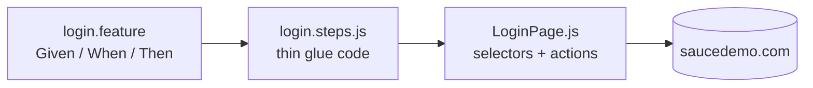

<div align="center">

# 🥒 Saucedemo – Cypress BDD

[](https://github.com/HivanA98/Cypress-CodeJS/actions/workflows/saucedemo-bdd.yml)


The [Saucedemo](../Saucedemo) suite rewritten as **business-readable Gherkin**.

</div>

## 🔄 How it fits together



Step definitions contain **no selectors** – every UI detail lives in the Page Objects, shared in design with the non-BDD suite.

## ✨ Highlights

- 📋 **Scenario Outline** + **Examples** for rejected logins, sorting and required checkout fields
- 🧾 **Data Tables** to set up the cart in a single readable step
- 🏷️ **Tags** – `npm run test:smoke` runs only `@smoke` scenarios
- 📊 Native **Cucumber HTML report**
- ⚙️ `@badeball/cypress-cucumber-preprocessor` 28 + esbuild bundler for fast compilation

## 🧪 Features

| Feature             | Scenarios | Techniques                                     |
| ------------------- | :-------: | ---------------------------------------------- |
| `login.feature`     |     6     | Background, Scenario Outline, `@smoke`         |
| `inventory.feature` |     6     | Scenario Outline for 4 sort options            |
| `checkout.feature`  |     5     | Data Table, Scenario Outline, end-to-end order |

```gherkin
Scenario Outline: Login is rejected – <case>
  When I log in with username "<username>" and password "<password>"
  Then I should see the login error "<message>"

  Examples:
    | case            | username        | password       | message                                             |
    | locked out user | locked_out_user | secret_sauce   | Epic sadface: Sorry, this user has been locked out. |
```

## 🗂️ Project structure

```
cypress/
├── e2e/*.feature            # Gherkin scenarios
├── pages/                   # Page Objects
├── fixtures/
└── support/
    ├── step_definitions/    # login, inventory, checkout steps
    └── commands.js          # cy.loginAs() with cy.session()
```

## 🚀 Run it

```bash
npm install
npm test              # all scenarios – report at cypress/reports/cucumber-report.html
npm run test:smoke    # @smoke only
npm run cy:open       # interactive
```
